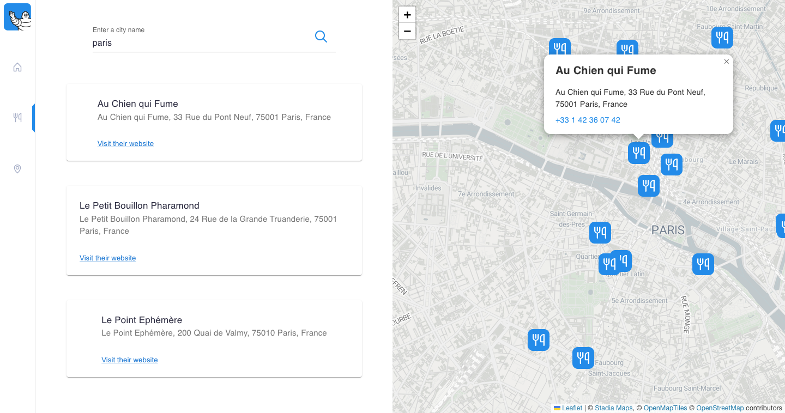

# Trip Advisor

This Trip Advisor-like app is coded with ReactJS + Material UI.

## You can:

- Select a category (restaurants, hotels, and attractions)
- Search for a city to get its corresponding places
- View the results both on a map and a list
- Interact with the map

## Screenshots




## Get started

Install all modules and their dependencies listed on package.json file:

```bash
npm install
```

Run the app on localhost:

```bash
npm start
```

## Built with

- ReactJS (context API + Axios).
- Material UI
